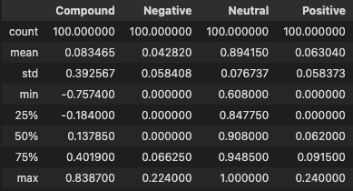
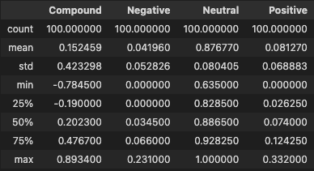
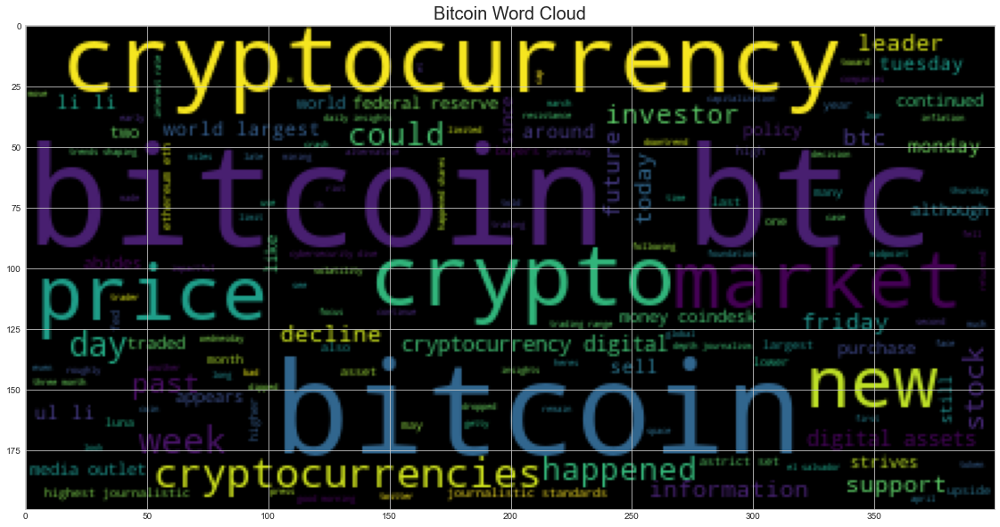
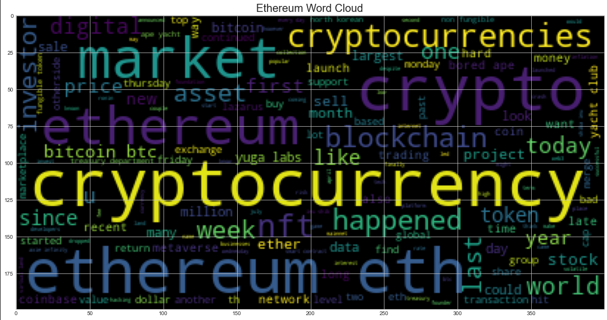
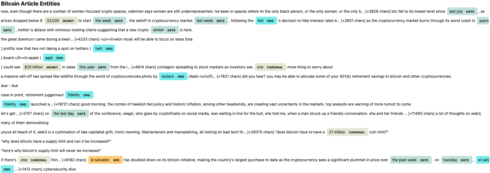
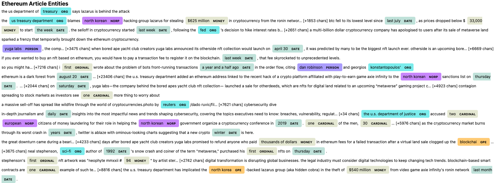

# Natural Language Processing

## Background

In this assignment, I apply natural language processing (NLP) to understand the sentiment in the latest news articles featuring Bitcoin and Ethereum as of 12 May 2022. 

Fundamental NLP techniques are used to better understand the other factors involved with the coin prices such as common words and phrases and organizations and entities mentioned in the articles.

Complete the following tasks:

1. [Sentiment Analysis](#1---Sentiment-Analysis)
2. [Natural Language Processing](#2---Natural-Language-Processing)
3. [Named Entity Recognition](#3---Named-Entity-Recognition)

---

## Files

[BTC & ETH - Analysis](Code/crypto_sentiment.ipynb)

---

## 1 - Sentiment Analysis

[Newsapi](https://newsapi.org/) was used to pull the latest news articles for Bitcoin and Ethereum. 

From this data a DataFrame of sentiment scores for each coin was created.

BTC Sentiment             |  ETH Sentiment
:-------------------------:|:-------------------------:
   |  

**Q: Which coin had the highest mean positive score?**

A: Ethereum had the highest positive mean score of 0.081 compared to Bitcoin's 0.062.

**Q: Which coin had the highest compound score?**

A: Ethereum had the highest compound max score of 0.89 compared to Bitcoin's 0.84. Additionally, Ethereum had a higher mean compound score of 0.19 compared to Bitcoin's 0.07

**Q. Which coin had the highest positive score?**

A: Ethereum had a higher max positive score of 0.33 compared to Bitcoin's 0.24.

---

## 2 - Natural Language Processing

In this section, I use NLTK and Python to tokenize text, find n-gram counts, and create word clouds for both coins. 

--- 

### 3 - Named Entity Recognition

In this section, you will build a named entity recognition model for both coins and visualize the tags using SpaCy.

---

### Resources

* [Newsapi](https://newsapi.org/)
* [Vader Sentiment Analysis](http://www.nltk.org/howto/sentiment.html)
* [NLTK](http://www.nltk.org/)
* [Spacy](https://spacy.io/)

